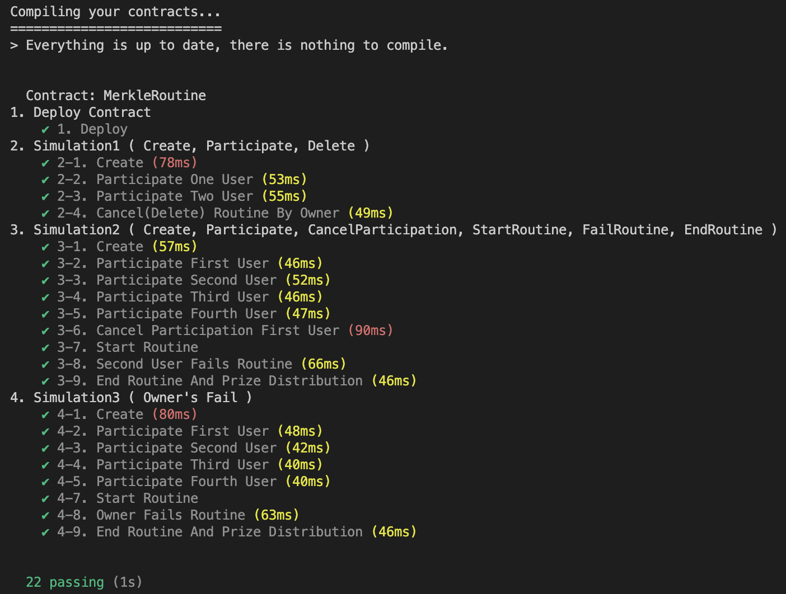

# Smart Contract

## Info

**contract address** : `0x23ce138d420b0A73a9B0c2e4aa428f8D1eF32A3d`

**abi** : [build/contracts/MerkleRoutin.json](./build/contracts/MerkleRoutine.json)

**deploy info**

```shell
Deploying 'MerkleRoutine'
   -------------------------
   > transaction hash:    0x5b4351937d05b33a8c922c6f773c40fdef13724b856fcd87587c86427825a68c
   > Blocks: 0            Seconds: 0
   > contract address:    0x534C0ED9452d64e535c172D16344856c7539f7d7
   > block number:        107514633
   > block timestamp:     1669420496
   > account:             0xbC14CB49b93Ee36AfdF4b49eCB7C9512f9353c93
   > balance:             4.8432099500051
   > gas used:            3247721 (0x318e69)
   > gas price:           50 gwei
   > value sent:          0 ETH
   > total cost:          0.16238605 ETH
```

**test**


## Todo

### SEND

1. [x] createRoutine (Routine)
       루틴 생성 : 챌린지 주최자가 챌린지를 생성하고 온체인에 등록합니다.
2. [x] deleteRoutine (id) -- 안씀
       루틴 취소 : 주최자가 챌린지를 취소합니다. 챌린지가 시작되기 전에만 실행가능하고 주최자만
       실행가능합니다. 모인 참가비는 참가자들에게 다시 분배됩니다.
3. [x] participateRoutine (id), value로 fee 지불
       루틴 참가 : 참여자가 루틴에 참여합니다. 이 때 주최자가 정한 참가비가 지불되어야합니다. 지불된
       참가비는 CA에 보관되다가 챌린지가 무산되거나 완료되면 분배됩니다.
4. [x] CancelParticipateRoutine (id)
       루틴 참가 취소 : 챌린지 참가를 취소합니다. 참가비는 다시 돌려받습니다.
5. [x] startRoutine (id)
       루틴 시작 : 더이상 참가 불가 챌린지 시작 일정에 맞춰 챌린지가 시작됩니다. BackEnd에서
       실행시켜줘야하며 챌린지가 시작되면 더이상의 참가는 불가능합니다.
6. [x] endRoutine (id)
       루틴 종료 : 루틴이 종료되고 성공한 참가자들에게 상금을 분배합니다.
7. [x] failRoutine (address)
       루틴 실패
8. [x] updateRefreeHistory
       레프리 기록 업로드

### CALL

1. [ ] Routines () returns (id[])
       루틴 : 현재 진행중인, 진행 전인 루틴을 모두 반환합니다.
2. [ ] participatedRoutine (address) returns (id)
       참가한 루틴 : 해당 계정의 참가자가 참가한 루틴을 모두 반환합니다.
3. [ ] memberNumOfRoutine (id) returns (uint)
       참가한 멤버 수 : 해당 루틴에 참가중인 참가자들의 수를 반환합니다.
4. [ ] memberOfRoutine (id) returns (address[])
       참가한 멤버 : 현재 해당 루틴에 참가하고 있는 주소들을 반환합니다.
5. [ ] feeOfRoutine (id) returns (uint256)
       총 상금 : 해당 루틴에 누적된 상금을 반환합니다.
6. [ ] statusRoutine (id) returns (bool)
       루틴 상태 : 해당 루틴이 진행중인지 진행중이 아닌지 반환합니다.
